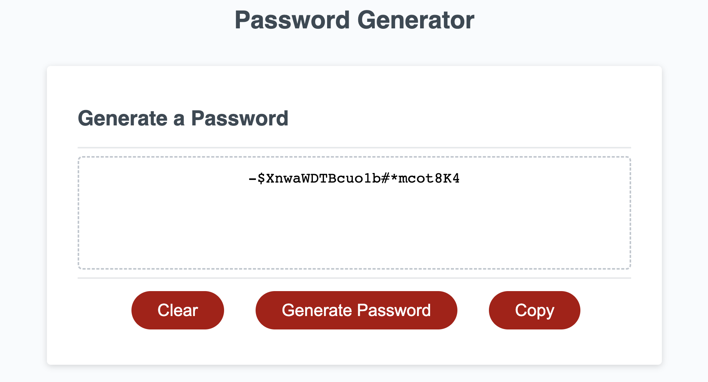

# Random Password Generator

## 💡 Description
This project is to create a functioning JavaScript file that interacts with a webpage, to output a random password when the user inputs their desired criteria and clicks the "Generate Password" button. This project helped me understand the importance of error logic and how impactful it is to the proper functioning of a program. I also learned how to validate expected data types and modify functions based on the validation. Overall I believe the skills needed to create this program serve as a solid introduction to the fundamentals of JavaScript. 

## 🔗 Links 

[Deployed Webpage](https://steven-mccombe.github.io/js-password-gen/)

## 📸 Screenshot 

## 📝 Credits

- HTML and CSS - Courtesy of [Columbia Coding Bootcamp.](https://bootcamp.cvn.columbia.edu/)
- Copy Button Logic - Courtesy of [MDN WebDocs](https://developer.mozilla.org/en-US/docs/Web/API/Clipboard/writeText)